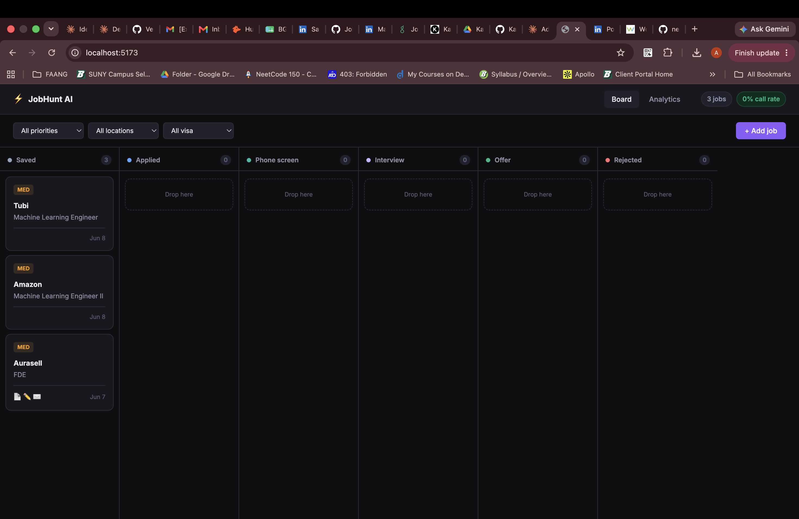
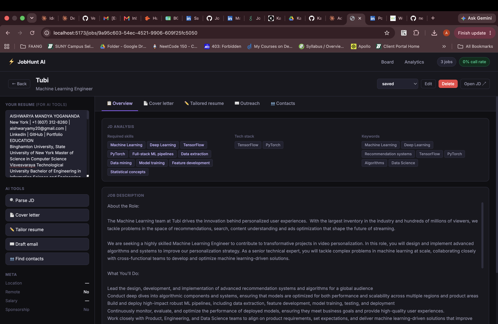
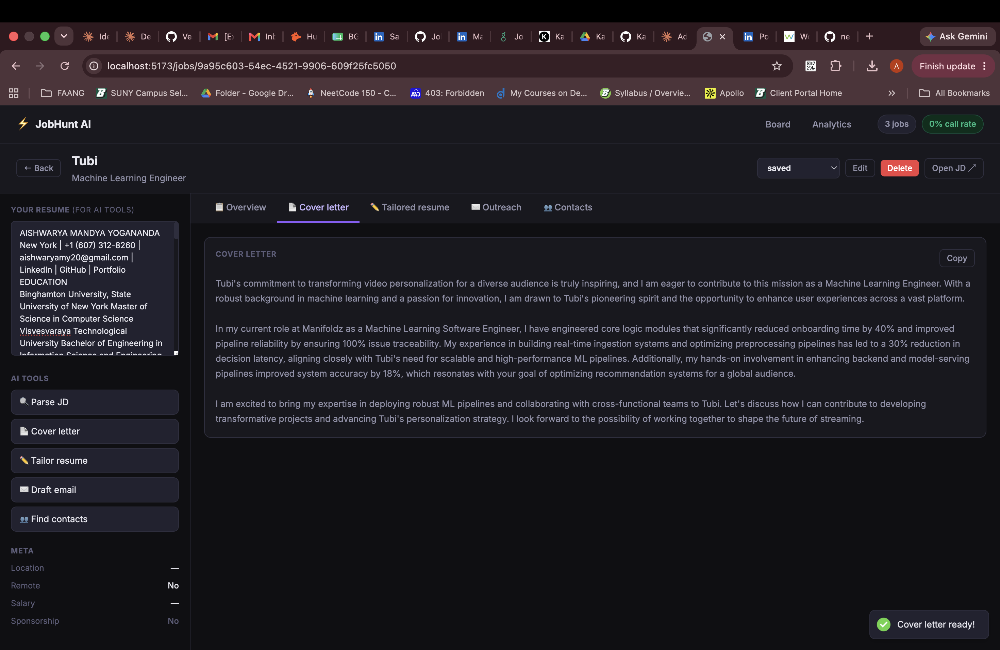
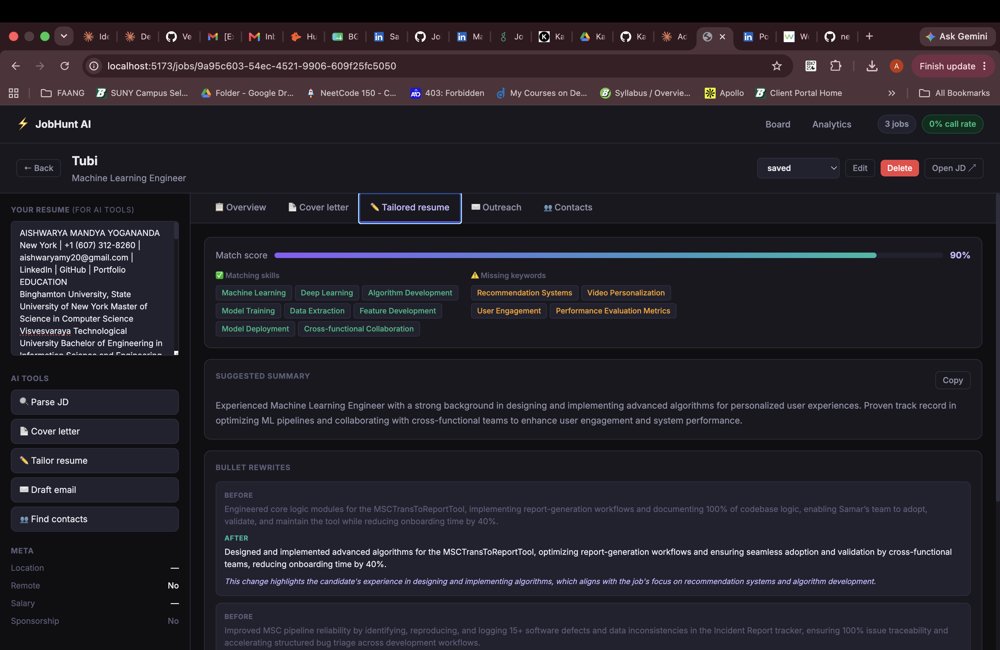
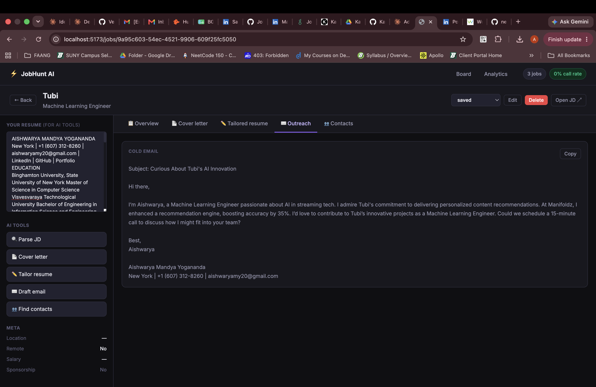

# NextHire — AI Job Search Copilot

> A full-stack AI-powered job hunt platform. Track applications, generate cover letters, tailor your resume, find contacts, and draft cold emails — all in one place.



## Features

- **Kanban board** — drag-and-drop job tracker across 6 stages (Saved → Applied → Phone Screen → Interview → Offer → Rejected)
- **AI cover letter generator** — personalized per company and role in seconds
- **Resume tailor** — rewrites your bullets to match JD keywords with before/after comparison and match score
- **Cold email drafter** — subject line + body tuned for response rates
- **Contact finder** — finds and ranks who to reach out to at any company via Hunter.io
- **JD parser** — extracts required skills, tech stack, sponsorship info, and keywords automatically

## Screenshots

### Job Board


### Job Detail + AI Tools


### Cover Letter Generator


### Resume Tailor — Before/After


### Outreach — Contact Finder + Email Draft


## Quick start (local)

```bash
# Clone
git clone https://github.com/aishwaryamy/nexthire.git
cd nexthire

# Backend
cd backend
python3.11 -m venv .venv
source .venv/bin/activate
pip install -r requirements.txt
cp ../.env.example .env    # add your API keys
uvicorn main:app --reload --port 8000

# Frontend (new terminal tab)
cd ../frontend
npm install
npm run dev
```

Open **http://localhost:5173**

## Environment variables

| Variable | Required | Description |
|---|---|---|
| `OPENAI_API_KEY` | ✅ Yes | Powers all AI features |
| `HUNTER_API_KEY` | No | Contact finder — 25 free searches/month at hunter.io |
| `ANTHROPIC_API_KEY` | No | Alternative LLM (Claude) |
| `DATABASE_URL` | No | Defaults to SQLite for local dev |

## Tech stack

**Backend** — FastAPI · SQLAlchemy · SQLite/PostgreSQL · OpenAI GPT-4o  
**Frontend** — React 18 · Vite · React Router  
**Infrastructure** — Docker Compose · Redis (optional)

## Roadmap

- [x] Kanban job tracker with drag and drop
- [x] AI cover letter generator
- [x] Resume tailor with match scoring
- [x] Cold email drafter
- [x] Contact finder via Hunter.io
- [x] JD parser — skills, tech stack, sponsorship detection
- [ ] Pattern analyzer — learns from your calls vs rejections
- [ ] Job discovery — scrapes and scores new roles against your success profile
- [ ] Interview prep agent — triggered when status moves to Interview
